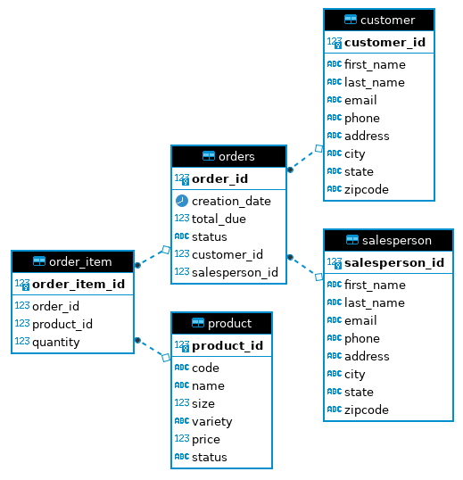

# Introduction
The Java Database Connectivity (JDBC) application is used to create a connection to a PostgreSQL database. 
The application allows for the user to perform preset operations to the database, such as CRUD (create, read, update, delete).
The project uses the following technologies:
* Java
* JDBC
* SQL
* Maven
* Docker
* PostgreSQL

# Implementaiton
## ER Diagram

## Design Patterns
### Data Access Object (DAO)
The Data Access Object (DAO) pattern is a design pattern that allows for isolation of the application or business layer from the 
persistence layer (a relational database). This is done using an abstract API. The purpose of this API is to hide from the 
application all the complexities involved in performing CRUD and other operations in the underlying program. It permits both layers to be 
developed separately without knowing about each other's processes.

### Repository
The Repository pattern consists of classes or components that encapsulate the operations used to access specific aspects of the database. 
This pattern is able to access one table per class and performing join operations in the java code rather than the database. 
The pattern also hides the data access functionalities such as CRUD, for easier maintainability. 
This allows the focus to be more on the data persistence logic rather than the data access plumbing. 
The DAO focuses on the abstraction of data persistence, while the Repository is an abstraction of a collection of objects.

# Test
The database was tested by creating tables and populating the database with sample data from SQL scripts. In order to test if these SQL 
statements were successful, queries were performed after any new data was added.`JDBCExecutor` was used to run and test functionality. 
CRUD operations and join operations were tested by creating, updating and deleting mock data and printing to the CLI to see if the expected
matches the results.