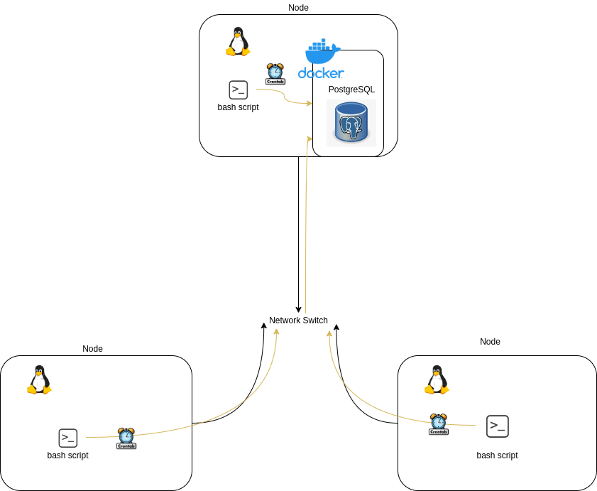

# Introduction
The Linux Cluster Monitoring Agent was created as a tool for the LCA team to monitor the 
resource usage of a Cluster of Linux nodes/servers running CentOS 7. It is designed to monitor 
each of these Devices via a local switch port communicating through internal IPV4 addresses. 
The test were done through a virtual machine, that acted as a node, created and hosted on the 
Google Cloud Platform. The data is collected and stored in a containerized RDBMS on one of the nodes
in the network to be used as analytical data that's purpose is to check for hardware failures and plan 
for hardware usage optimization. A crontab was implemented to see the current usage of the nodes
in the network in a set 1 minute interval. The data is tested and observed using Postgres SQL. The 
Application was built and managed using Git and uploaded to Github through an SSH connection.


Technologies used listed :
- Linux (Centos 7)
- Docker
- Postgres SQL
- Bash
- Git
- Github
- Google Cloud platform
- Crontab

# Quick Start
	1. Run a script to create a docker container to hold the SQL database

	```./scripts/psql_docker.sh create [db_username][db_password]```
	
	2. Rerun the script to start the docker container
	
	 ```./scripts/psql_docker.sh start [db_username][db_password]```
	
	3.  Connect to the psql instances and create the database host_agent
	
	```psql -h localhost -U postgres -W```
	```postgres=# CREATE DATABASE host_agent;```
	
	4.Execute the ddl.sql script on the host_agent database 
	
	```psql -h localhost -U postgres -d host_agent -f sql/ddl.sql```
	
	5. Insert the hardware specification data in host_info table using the host_info.sh script. 
	
	```./scripts/host_info.sh psql_host psql_port db_name psql_user psql_password```
	
	6. Insert the hardware usage data into the host_usage table using the host_usage.sh script.
	
	```./scripts/host_usage.sh psql_host psql_port db_name psql_user psql_password```
	
	7. Enter in the Crontab editor.
	  
	```Crontab -e```
	
	8. In the Crontab editor, automated the host_usage script in 1 minute interval and log the stout into a log file.
	
	```* * * * * bash ~/linux_sql/host_agent/scripts/host_usage.sh localhost 5432 host_agent postgres password > /tmp/host_usage.log```
	
	9. Use queries.sql script to test the database against different queries (more details on the queries below).
	
	```psql -h localhost -U postgres -d host_agent -f sql/queries.sql```


# Implemenation
The Linux Cluster Monitoring Agent was implemented using a docker container. The container instances
contains a PSQL database where the data was to be stored. Each node in the network contains the scripts
that initially retrieves the hardware information and usage. The Crontab then periodically records the usage
in set intervals.

## Architecture


#Scripts

	-``` psql_docker.sh```
	This scripts creates, start, or stop the docker container that holds the PSQL database
	```./scripts/psql_docker.sh create|start|stop [db_username][db_password] ```

	-``` host_info.sh```
	Retrieves the information of the node's hardware specification : formatted as ; hostname, cpu_number, cpu_architecture, cpu_model, cpu_mhz, l2_cache, total_memory, and timestamp and inserts it into the PSQL database.
	```./scripts/host_usage.sh psql_host psql_port db_name psql_user psql_password ```
	
	-``` host_usage.sh```
	Retrieves the current use of the node's hardware : formatted as ; timestamp, hostname, free_memory, cpu_idle, cpu_kernel, disk_io, and disk_available
	```./scripts/host_usage.sh psql_host psql_port db_name psql_user psql_password ```
	
	```ddl.sql```
	The Sql file changes to host agent database then creates host_info and host_usage tables 
	```psql -h localhost -U postgres -d host_agent -f sql/ddl.sql```

	- ```Crontab```
	The Cron Job automates the collection of the nodes hardware usage per 1 minute intervals and logs the stout into /tmp/host_usage.log


## Database Modeling
- host_info TABLE

| Attributes       | Data Type | Constraints     | Description                                               |
|------------------|-----------|-----------------|-----------------------------------------------------------|
| id               | SERIAL    | PRIMARY KEY     | Auto-increment to differentiate the data in PSQL Database |
| hostname         | VARACHAR  | NOT NULL UNIQUE | Host node name                                            |
| cpu_number       | INTEGER   | NOT NULL        | Number of CPUs on the host node                           |
| cpu_architecture | VARACHAR  | NOT NULL        | CPU architecture type                                     |
| cpu_model        | VARACHAR  | NOT NULL        | CPU processor model                                       |
| cpu_mhz          | INTEGER   | NOT NULL        | CPU speed (MHz)                                           |
| L2_cache         | INTEGER   | NOT NULL        | L2 cache size (kB)                                        |
| total_mem        | INTEGER   | NOT NULL        | Node's total memory(kB)                                   |
| timestamp        | TIMESTAMP | NOT NULL        | Time of data entry                                        |
- host_usage TABLE

| Attributes     | Data Type | Constraints     | Description                        |
|----------------|-----------|-----------------|------------------------------------|
| timestamp      | TIMESTAMP | NOT NULL        | Time of data entry                 |
| host_id        | SERIAL    | FOREIGN KEY     | References id from host_info Table |
| memory_free    | INTEGER   | NOT NULL        | Total node's unused memory (mB)    |
| cpu_idle       | INTEGER   | NOT NULL        | CPU processor idle time (%)        |
| cpu_kernel     | INTEGER   | NOT NULL        | CPU kernel run time (%)            |
| disk_io        | INTEGER   | NOT NULL        | Number of disk I/O                 |
| disk_available | INTEGER   | NOT NULL        | Total available disk space (mB)    |

# Test
The Linux Cluster Monitoring Agent was on a Centos 7 Operating system hosted on the 
Google Cloud platform using a Virtual Network Computing Viewer as the Graphical interface and 
The scripts were tested with inputs with invalid inputs and valid inputs. The data was observed on 
Postgres SQL with multiple SQL queries .

# Deployment
The Linux Cluster Monitoring Agent used Docker containers to manga the Postgres database instance and
Crontab was used for periodically set script execution. The source code was managed using git and pushed 
to Github following Gitflow.

# Improvements
- Implement a script that can shorten set up time.
- Implement a feature that can handle hardware changes and update the respective host data on the database.
- Create a script that queries the database for host's that are under a certain usage numeric.
